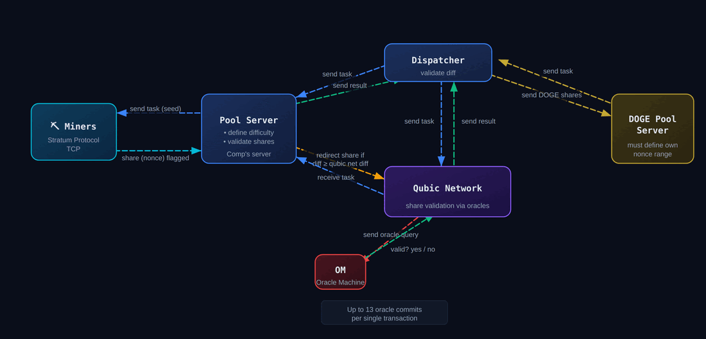

# Qubic Doge Mining

## Overall Design



## Communication with the Qubic Network

The Dispatcher communicates with the Qubic Network via custom qubic mining tasks and solutions.
To facilitate easy addition of other custom mining types apart from DOGE, the code defines generic structs that can contain task descriptions and solutions for different types.

```cpp
enum CustomMiningType : uint8_t
{
    DOGE,
};

/**
 * @brief A generic custom mining struct that can contain mining task descriptions for different types.
 */
struct CustomQubicMiningTask
{
    uint64_t jobId; // millisecond timestamp as dispatcher job id
    uint8_t customMiningType;

    // Followed by the specific task struct, e.g. QubicDogeMiningTask for CustomMiningType::DOGE.

    // Followed by the dispatcher signature (SIGNATURE_SIZE bytes).
};

/**
 * @brief A generic custom mining struct that can contain mining solutions for different types.
 */
struct CustomQubicMiningSolution
{
    std::array<uint8_t, 32> sourcePublicKey; // public key of the sender (miner), used for signature verification
    uint64_t jobId; // millisecond timestamp as dispatcher job id
    uint8_t customMiningType;

    // Followed by the specific solution struct, e.g. QubicDogeMiningSolution for CustomMiningType::DOGE.

    // Followed by the sender's signature (SIGNATURE_SIZE bytes).
    // The signature covers all bytes after RequestResponseHeader up to (but not including) the signature itself.
};
```

For DOGE mining specifically, we use the following structs for tasks and solutions:
```cpp
/**
 * @brief A struct for sending a mining task to the Qubic network.
 */
struct QubicDogeMiningTask
{
    uint8_t cleanJobQueue; // flag indicating whether previous jobs should be dropped
    std::array<uint8_t, 4> dispatcherDifficulty; // dispatcher difficulty, usually lower than pool and network difficulty, same compact format
    
    // The Dispatcher always expects a size of 8 bytes for the extraNonce2, 4 bytes for comp id, 4 bytes for miner to iterate.
    static constexpr unsigned int extraNonce2NumBytes = 8;

    // Data for building the block header, the byte arrays are in the
    // correct order for copying into the header directly.
    std::array<uint8_t, 4> version; // version, little endian
    std::array<uint8_t, 4> nTime; // timestamp, little endian
    std::array<uint8_t, 4> nBits; // network difficulty, little endian
    std::array<uint8_t, 32> prevHash; // previous hash, little endian
    unsigned int extraNonce1NumBytes;
    unsigned int coinbase1NumBytes;
    unsigned int coinbase2NumBytes;
    unsigned int numMerkleBranches;
    // Followed by the payload in the order
    // - extraNonce1
    // - coinbase1
    // - coinbase2
    // - merkleBranch1NumBytes (unsigned int), ... , merkleBranchNNumBytes (unsigned int)
    // - merkleBranch1, ... , merkleBranchN
    // Note: extraNonce1, coinbase1/2, and merkle branches have the same byte order as sent via stratum,
    // which should be correct for constructing the merkle root.
};

/**
 * @brief A struct for receiving mining solutions from the Qubic network.
 */
struct QubicDogeMiningSolution
{
    std::array<uint8_t, 4> nTime; // the miner's rolling timestamp, little endian (same byte order as used in the block header)
    std::array<uint8_t, 4> nonce; // little endian (same byte order as used in the block header)
    std::array<uint8_t, 32> merkleRoot; // to avoid dispatcher having to calculate the root again, same byte order as used in the header
    std::array<uint8_t, 8> extraNonce2; // same byte order as it was used to create the merkle root
};
```

Example code for receiving tasks sent by the Dispatcher and sending found solutions is contained in the `testminer` project (see [projects contained in the dispatcher folder](dispatcher/README.md)).
