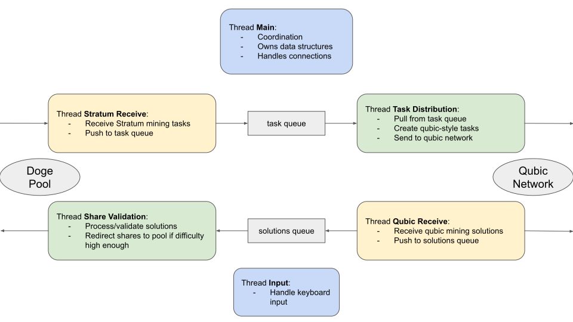

# Qubic Doge Dispatcher

## Project Structure

The Qubic Doge Dispatcher project consists of the following targets to build:
- `hashutil`: A library providing utility for hashing and mining difficulty representations.
- `dispatcherlib`: A library providing the core dispatcher functionality and data structs used by both the main and test dispatcher.
- `qubicdogedispatcher`: The main Dispatcher application to act as a bridge between a doge mining pool and the Qubic network.
- `testdispatcher`: The test Dispatcher application that mimics a bridge between a doge mining pool and the Qubic network.
- `testminer`: A test miner application to mine tasks from the Dispatcher.

## Application Architecture



`qubicdogedispatcher`

First opens connections to the mining pool via stratum TCP and to the Qubic network (Qubic TCP handshake).
Then starts the following threads for the main loop:
 * `inputThread`: to react to key presses (currently supported: 'q' to quit).
 * `stratumRecvThread`: to receive messages from the mining pool via stratum TCP.
 * `taskDistThread`: to process received stratum messages and send them to the Qubic network.
 * `qubicRecvThread`: to receive solutions from the qubic network.
 * `shareValidThread`: to validate received solutions and submit to pool if difficulty is high enough.

`testdistpacther`

In contrast to the real `qubicdogedispatcher` application, the testdispatcher does not have a real stratum connection to a mining pool.
Instead, pre-recorded example tasks are distributed to the Qubic network for testing.
 
First opens connections to the Qubic network (Qubic TCP handshake).
Then starts the following threads for the main loop:
 * `inputThread`: to react to key presses (currently supported: 'q' to quit).
 * DUMMY `stratumRecvThread`: to continuously push stratum messages onto the queue.
 * `taskDistThread`: to process received stratum messages and send them to the Qubic network.
 * `qubicRecvThread`: to receive solutions from the qubic network.
 * `shareValidThread`: to validate received solutions, the testdispatcher does not submit to a pool.

`testminer`

The testminer starts listening on the specified port for a connection from the Dispatcher. 
Once the connection is established, it starts the following threads for the main loop of the application:
 * `inputThread`: to react to key presses (currently supported: 'q' to quit).
 * `taskRecvThread`: to receive tasks from the dispatcher.
 * `miningThread`: to mine received tasks and send found solutions back to dispatcher.

## How to Build

The project can be built independently of the operating system via CMake, either using the CMake GUI or via command line:
```
mkdir build
cd build
cmake ..
```

## License

The file `src/hash_util/scrypt.c` is published under a different license as it has been copied from the Tarsnap online backup system. Please refer to the file directly for more information.
